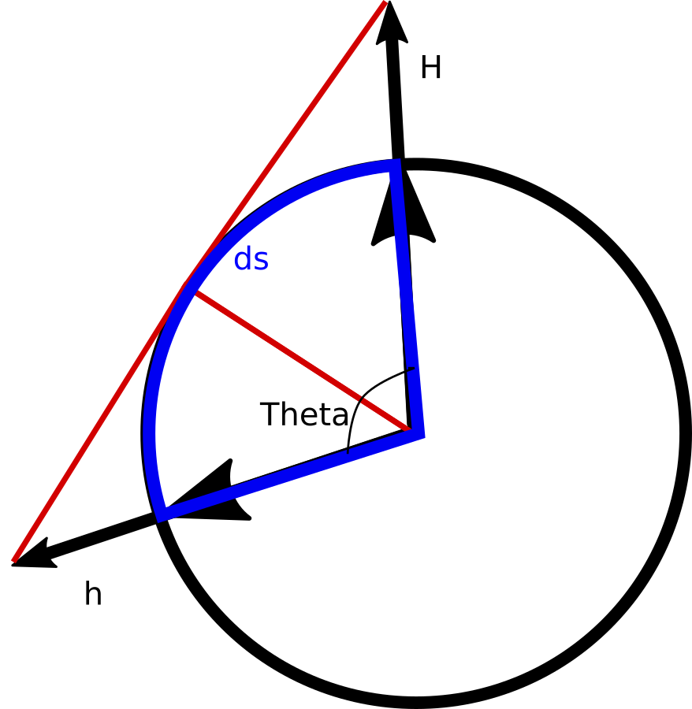
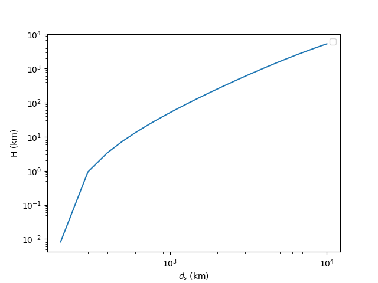

# Calculo de Campo de visada


Vamos considerar a figura a seguir. No ponto de altura h acima da superfície da Terra, a distância até o horizonte, na direção da linha vermelha é:

d<sub>h</sub> = sqrt(2hR + h<sup>2</sup>),

em que R é o raio de curvatura da Terra e sqrt é a raiz quadrada. Posicionando agora uma pessoa a uma distância d<sub>s</sub> e a uma altura H do indivíduo que está na posição inicial (em h). A pergunta é, qual o menor valor de H para que, uma pessoa que está além do horizonte de h, possa ser vista, mesmo com a curvatura da Terra?




Essa questão está ligada com o chamado campo de visada, que é o quanto conseguimos ver na direção da linha do horizonte.
A linha que une h com H é chamada de linha de visada. Essa linha é utilizada para determinar o posicionamento e altura de antenas de transmissão via rádio, por exemplo. Assim, para que haja cobertura de sinal de celular, a posição das antenas procura respeitar, entre outras coisas, essa linha de visada.


A distancia entre a linha de visada do ponto hH é

d<sub>v</sub> = d<sub>h</sub> + d<sub>H</sub>,


Outra coisa interessante de se saber é qual o valor de H para distâncias d<sub>s</sub> maiores que d<sub>h</sub>?

Nesse caso, a distância d<sub>H</sub> é dado pela diferença:

d<sub>H</sub> = d<sub>s</sub> - d<sub>h</sub>

Usando a relação trigonométrica é possível mostrar que:

H = sqrt((d<sub>s</sub> - d<sub>h</sub>)<sup>2</sup> + R<sup>2</sup>) - R

Essa equação é válida para d<sub>s</sub> > d<sub>h</sub>.


Observe que esse caso é válido para uma superfície sem atmosfera ou em que a sua densidade não varia com a altura. Na Terra a refração gerada pela variação de densidade do ar nas diversas camadas tem um efeito importante.


Vamos considerar o caso de um observador no topo Finestrelles, que tem altura h de 2826 m. Qual é o valor da distância da linha de visada para um observador em H=3880 metros (altura do Pico Gaspard). Ou seja, qual deve ser a posição limite do pico Gaspard para que a sua ponta apareça na foto de alguém que está no Finestrelles? Aqui é muito importante ressaltar que essa conta é válida para o vácuo, sem assumir a variação de densidade da atmosfera com a altura.

Para facilitar a nossa vida, criei um programa em Python para calcular esses valores:


```python
#!/usr/bin/env python3.6
#-*- Coding: UTF-8 -*-
from math import cos, sqrt, pi

def visada(h, H, R, verbose=True):
    dh = sqrt(2 *  h * R  + h ** 2.0)
    dH = sqrt(2 *  H * R  + H ** 2.0)

    dv = dh + dH
    if verbose is True:
        print("O horizonte de h está à: {0:8.2f}km".format(dh/1000))
        print("O horizonte de H está à: {0:8.2f}km".format(dH/1000))
        msg = "A linha de visada entre os dois será dv:"
        msg += "{0:8.2f}km".format(dv / 1000)
        print(msg)

def H(h, ds, R, verbose=True):
    theta = ds / R
    dh = sqrt(2 *  h * R  + h ** 2.0)
    dsh = ds - dh
    H = sqrt(dsh ** 2.0 + R ** 2.0) - R
    if verbose is True:
        print("Angulo entre os dois pontos: \u03B8: {}".format(theta))
        print("Linha do Horizonte de h:{0:9.2f}km".format(1.08 * dh / 1000))
        print("Assumindo h: {0}km, ds: {1}km o valor de H será: {2:9.2f}m".format(h/1000, ds/1000, H))
    return H


if __name__ == "__main__":
    visada(2826, 3880, 6371000)

    from numpy import roots, linspace, array
    import matplotlib.pyplot as plt
    x = linspace(200000, 10000000, 100)
    Hv = array([H(2826, xi, 6371000, verbose=False) for xi in x])
    plt.plot(x / 1000, Hv / 1000)
    plt.yscale("log")
    plt.xscale("log")
    plt.xlabel(r"$d_{s}$ (km)")
    plt.ylabel(r"H (km)")
    plt.legend()
    plt.show()
```


Como resultado temos que o valor de d<sub>v</sub> entre os dois picos é de 412 km. A distância entre os dois picos é de 443 km. Nesse caso, o Gaspard está a 31 km além do limite do horizonte. Então sem considerar a variação da atmosfera é impossível ver o Gaspard a partir do Finestrelles.


A figura a seguir mostra o cálculo da variação de H com a distância para um observador que está a uma altura de 2826 m.




## TODO

Adicionar o cálculo da linha de visada como função da variação do índice de refração da atmosfera com a altura.
